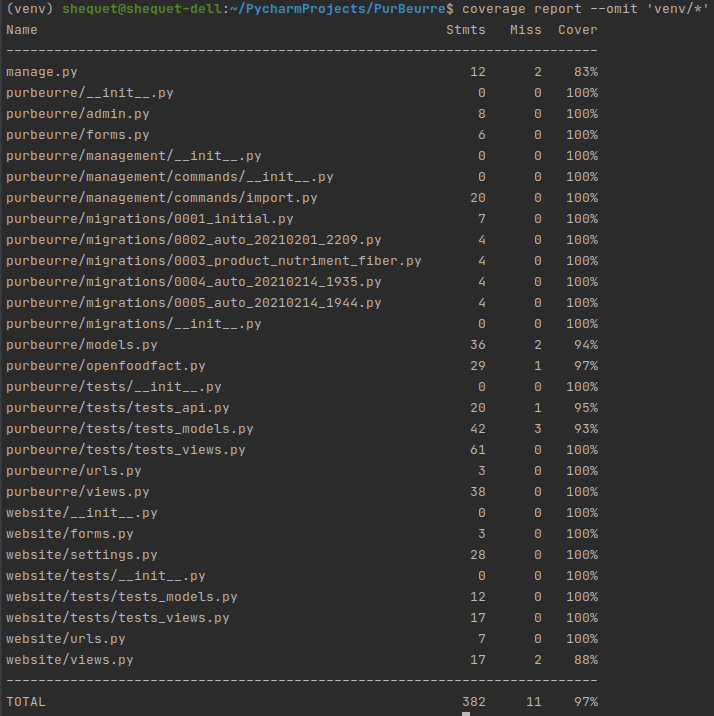
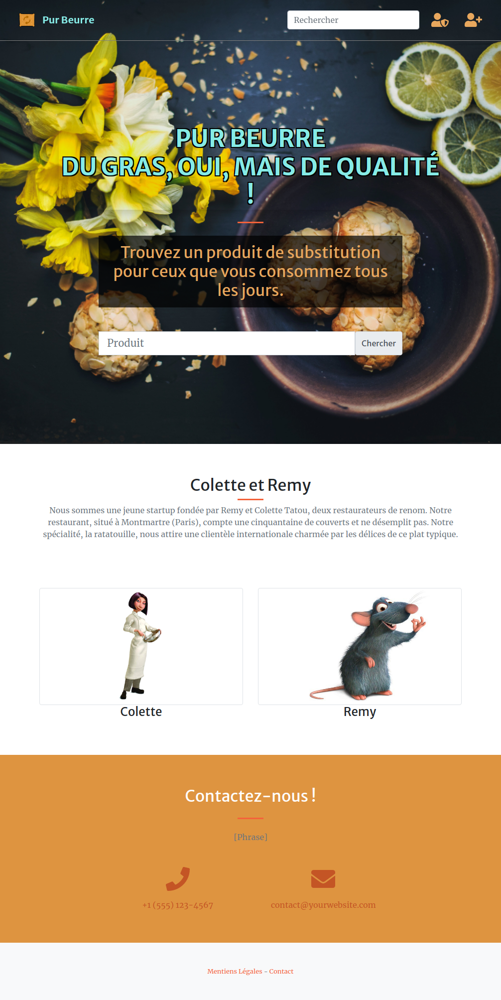
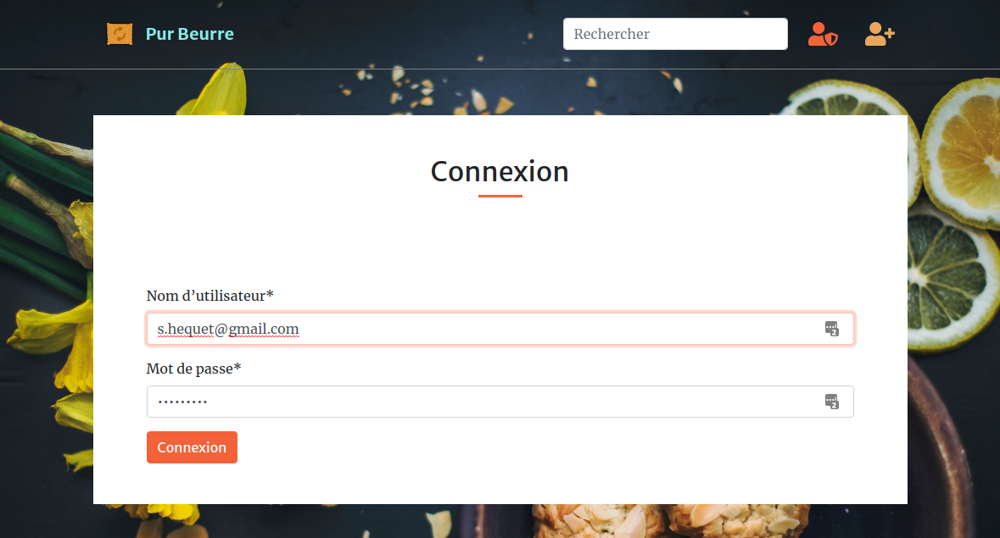
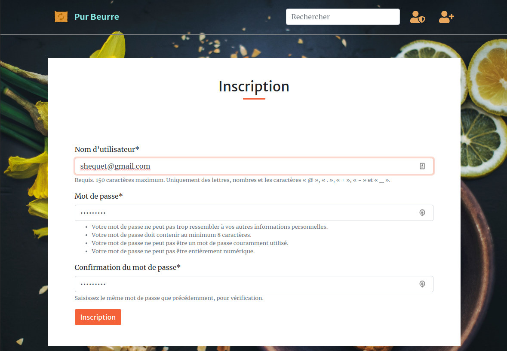
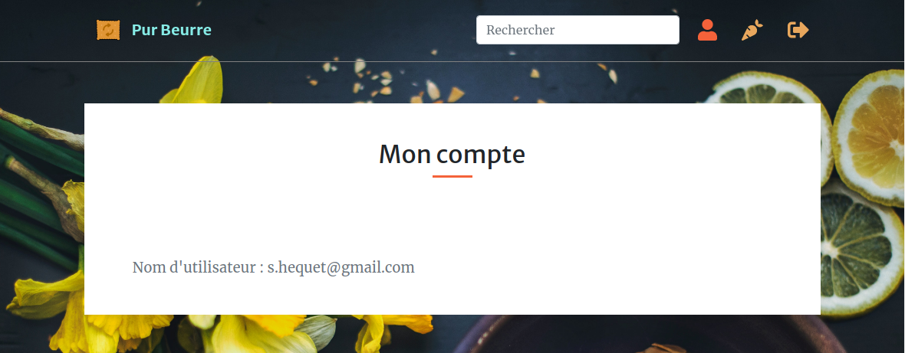
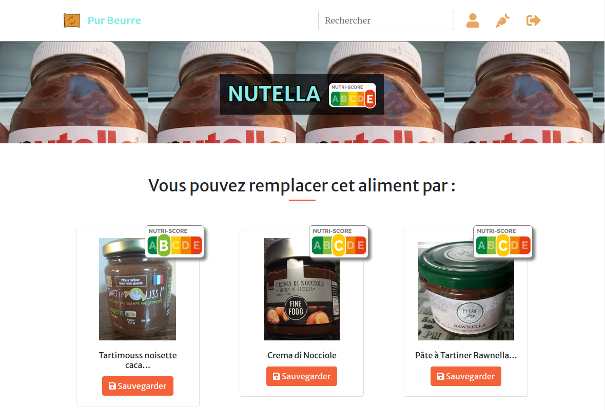
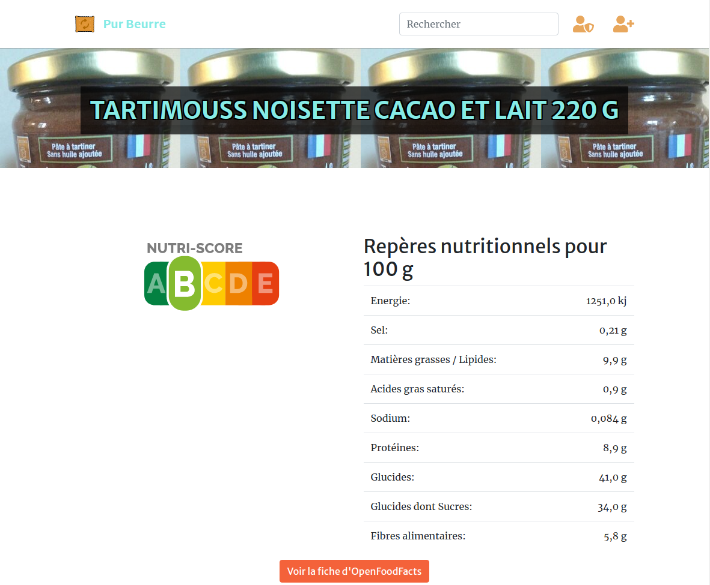
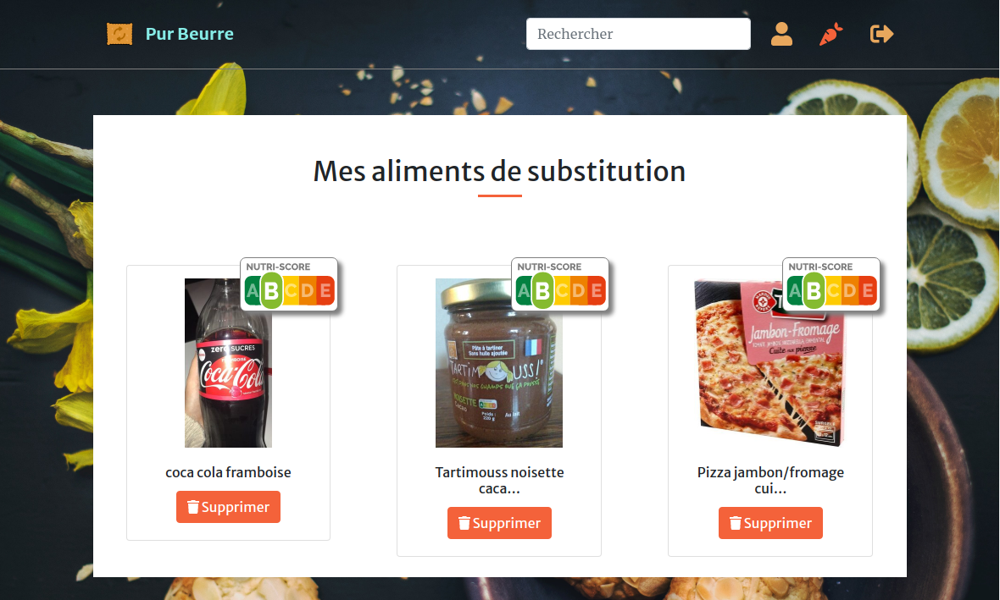

# PurBeurre

### Installation

Après avoir créé un virtual env, installez les dépendances via le requirements.txt

```shell
pip install -r requirements.txt
```

### Ajout des produits à partir d'une catégories d'Open Food Facts :

Clé de l'API google pour la carte en JavaScript
```shell
python manage.py import 'pates-a-tartiner-aux-noisettes-et-au-cacao'
```

### Démarrer le serveur Web Dajngo en mode développeur
```shell
python manage.py runserver
```

### Lancer les tests

Adpater l'exclusion de l'environnement virtuel  ``'venv/*'``
```shell
coverage report --omit 'venv/*' manage.py test
```

### Valider la couverture des tests ~97%

Adpater l'exclusion de l'environnement virtuel  ``'venv/*'``
```shell
coverage report --omit 'venv/*'
```


### Démo en ligne sur herokuapp

https://hidden-earth-51371.herokuapp.com

### Accueil


### Connexion utilisateur


### Création d'un compte utilisateur


### Page mon compte


### Recherche Nutella


### Détail d'un produit


### Mes aliments de substitution
